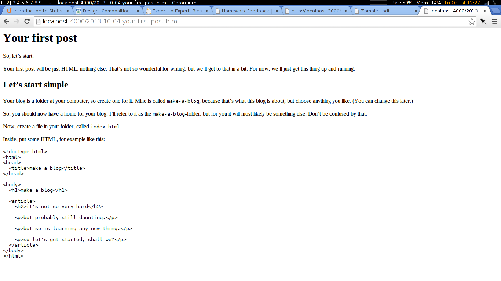

---
---

# Your first post

So, let's start.

Your first post will be just HTML, nothing else. That's not so wonderful
for writing, but we'll get to that in a bit. For now, we'll just get this
thing up and running.

## Let's start simple

Your blog is a folder at your computer, so create one for it. Mine is called
`make-a-blog`, because that's what this blog is about, but choose anything
you like. (You can change this later.)

So, you should now have a home for your blog. I'll refer to it as the
`make-a-blog`-folder, but for you it will most likely be something else.
Don't be confused by that.

Now, create a file in your folder, called `index.html`.

Inside, put some HTML, for example like this:

    <!doctype html>
    <html>
    <head>
      <title>make a blog</title>
    </head>

    <body>
      <h1>make a blog</h1>

      <article>
        <h2>it's not so very hard</h2>

        
but probably still daunting.

        
but so is learning any new thing.

        
so let's get started, shall we?

      </article>
    </body>
    </html>

Ok, that's your blog. I'm not kidding, that's really all it takes. Of course
we're going to take it further, but at the core it's that simple.

So, what does it look like? Well, go to your browser and open the `index.html`
file with it (either use the menu `File -> Open` or press `Ctrl-o` and navigate
to the file).

Well, it's a start, right?

## Next steps

Write something! Turn off your computer, go for a little walk, think for a bit
and then write something. Or take one of those unpublished ramblings and put `
`
before each paragraph and `
` after and paste it inside that `<article>`
element inside the `index.html` file. Or just say hello. It doesn't really
matter what it is, as long as you get started and write *your* first post.

Not pretty enough? Well, we can fix that!

Something else? Tell me about it!